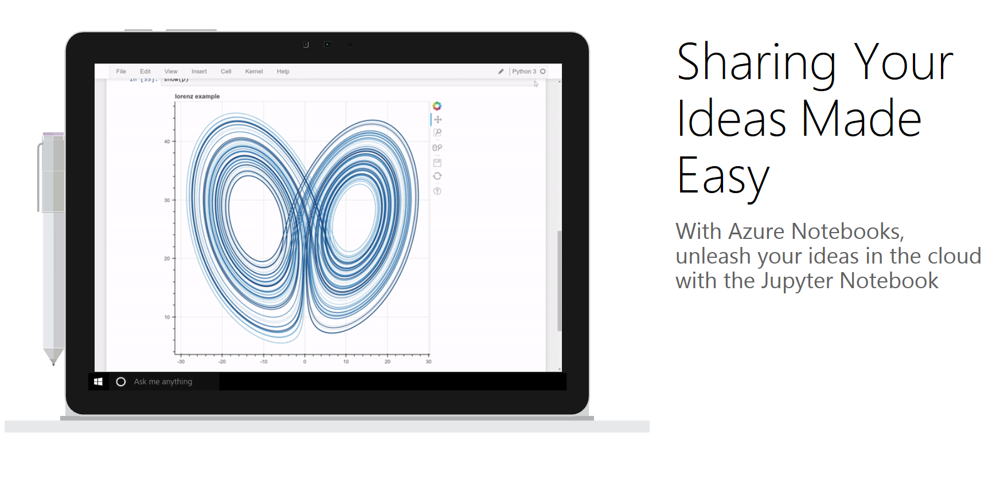

# Azure Notebooks

Computational Notebooks as a Service: <https://notebooks.azure.com/>.

## Write and share your ideas with Jupyter Notebooks

**Express with Notebooks:**
  We all have ideas.  With Azure Notebooks, you can write down your ideas using
  words and pictures, and you can make them come alive with code that you write
  in Python, R, or F#.  Azure Notebooks are powered by the Jupyter Open Source
  project, which currently has over 3 million users.

**Share Notebooks:**
  Azure Notebooks also makes it easy for you to share your ideas with your
  colleagues or even with anyone who has access to the web.  But we go further
  than that: we make it easy for them to build their own ideas starting from
  yours!

## About this repo

This GitHub repo is intended for reporting, discussing, and tracking customer
issues.

<strong><em>Table of Contents</em></strong>

* [Give it a try](#give-it-a-try)
* [Get involved](#get-involved)
* [Filing issues](#filing-issues)
* [FAQs](#faqs)
* [Resources](#resources)

## Give it a try

We have a [suite of sample notebook libraries](https://notebooks.azure.com/Microsoft/libraries/).
These are real life notebooks that we have used for our own data science work and
training at Microsoft.  Some of them are examples from the work we have done
with customers of our machine learning services.  A welcome notebook gives you
a quick tour of Jupyter.

* [Intro to Python](https://notebooks.azure.com/Microsoft/libraries/2018-Intro-Python)
* [Data Science Fundamentals with Python](https://notebooks.azure.com/rheartpython/libraries/PythonDS101)
* [Discover Sentiments in Tweets](https://notebooks.azure.com/Microsoft/libraries/2018-Sentiments/html/Discover%20Sentiments%20in%20Tweets.ipynb)

Note: You don't need an account to view notebooks.  You will need a Microsoft
account (Outlook, Hotmail, Xbox, etc) to run. At that time you'll be prompted to create one.

## Get involved

* [File an issue](https://github.com/Microsoft/AzureNotebooks/issues/new) for
  bugs, feature requests, etc.  If you need immediate assistance, ping
  <nbhelp@microsoft.com>.
* Have a cool notebook you want to share?  Upload & tweet with #Azurenotebooks!
* Are you teacher giving a large class or want to give webinar?  Test drive the
  site and if possible a heads up on the date & number of users:
  <nbhelp@microsoft.com>.

## [Filing issues](https://github.com/Microsoft/AzureNotebooks/issues/new)

Knowing the context of your issues will help us solve it faster. Please include
as much of the following as you can while creating issues:

* Whether the issue is related to Jupyter Notebooks or the Libraries feature.
* The Jupyter Kernel (Python2, Python3, or R) in case of problems with a
  Jupyter Notebook.
* Time of occurrence.
* Web browser the issue occurred in.
* If the issue occurred once or can be reproduced (with steps to repro it).
* LibraryID and Notebook Name.
* Logs (`!cat .nb.log` or: New/Terminal, `$ cat .nb.log`).
* Usage scenario: teaching a class, doing homework, evaluating results for
  research.
* Add template to root.

## FAQs

### What is Jupyter?

Jupyter (formerly IPython), is a multi-lingual REPL on steroids.  This is a
free service that provides Jupyter notebooks along with supporting libraries as
a service.  It means you can just login and use, no installation/setup is
necessary.  Instructors can also use the service by easily sharing a notebook.
Students get their own private copies that can be run.  The service is provided
by the Python team @ Microsoft, which is part of the Data Group.

### What environments are supported and how can I install packages?

Python 3.6.x Python 2.7.x (Anaconda3 and Anaconda2 5.3.0) with many additional
packages.
- You can install packages in a Python notebook: `!pip install <pkg-name>`
- You can also install packages using conda:
  `!conda install -y --name root <pkg-name>`

We also support R (3.4.1 running MRO) and F# (4.1)
- You can install packages in R: `install.packages("pkg-name")`

[Full FAQs](https://notebooks.azure.com/faq)

## Resources

* [Jupyter Project](https://jupyter.org/)

* [Email Azure Notebooks for Help](mailto:nbhelp@microsoft.com)

* [Azure Notebooks on Twitter](https://twitter.com/AzureNotebooks)
